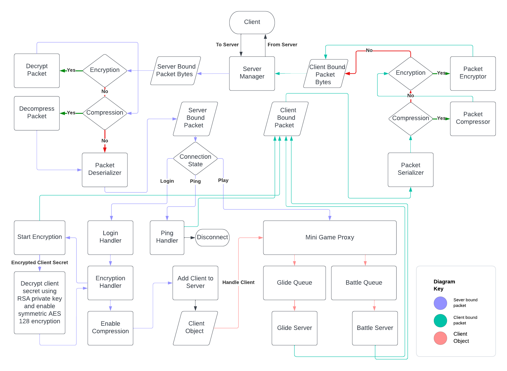
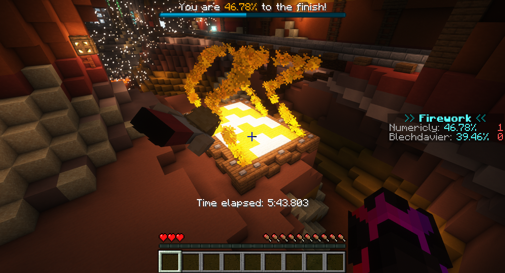
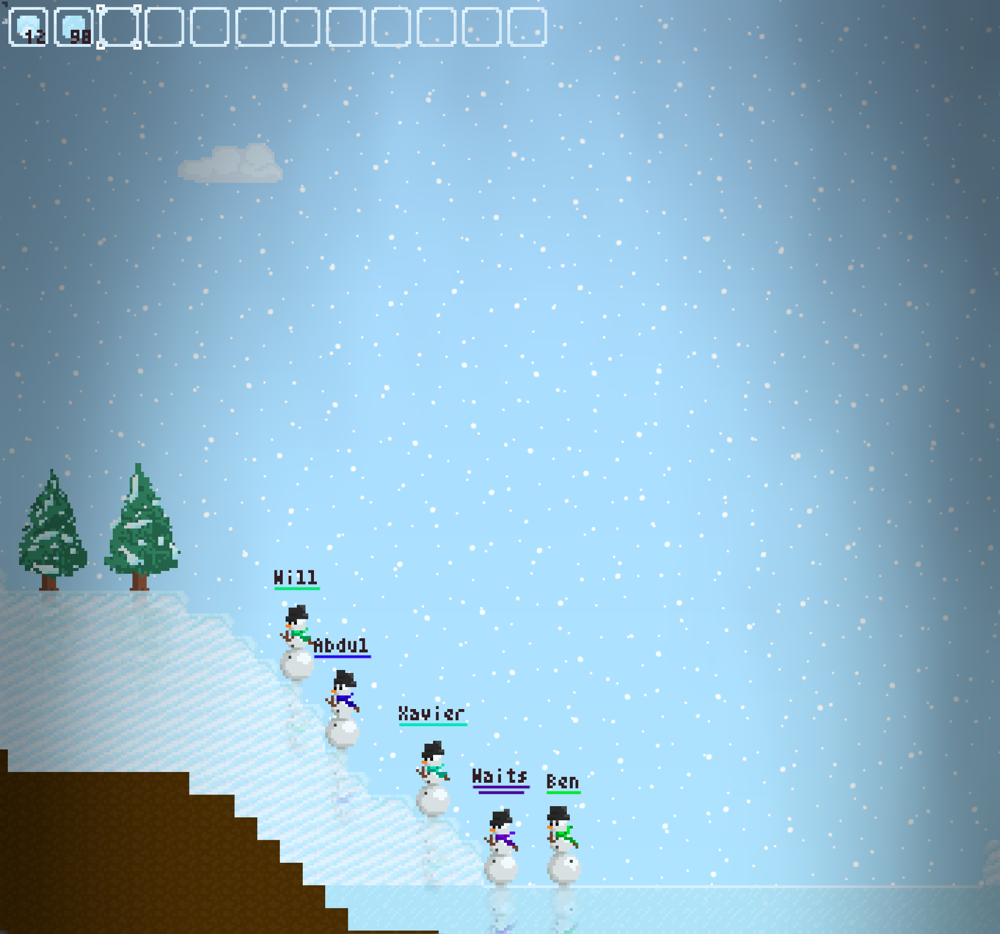
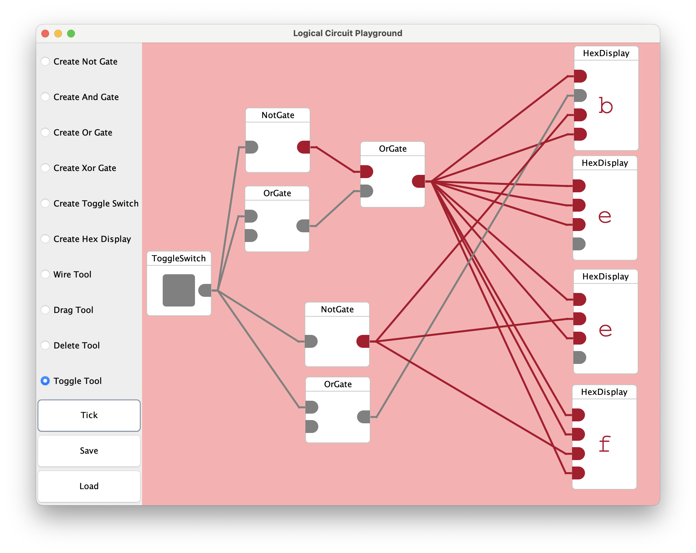

## Hi, I'm Xavier!

I'm a second-year computer science student at UBC, and I'd like to take this space to showcase some projects I'm proud of:

### FIRST Robotics [(2025)](https://github.com/frc5687/2025-robot), [(2024)](https://github.com/frc5687/2024-robot), [(2023 onboarding)](https://github.com/frc5687/2023-swerret)

`java`, `robotics`, `computer vision`

I joined my local FIRST Robotics Competition team as a programmer in summer 2023, becoming the primary code contributor for **4x award-winning autonomous and control systems**. In 2025, the team globally ranked **20th/3,702** in autonomous scoring and **39th/3,702** in overall scoring.

My favourite problem was robot localization, and at different times we incorporated data from:

- Wheel encoders
- Gyroscope + Accelerometer
- Cameras with AprilTag detection (see PhotonVision + Limelight)
- and an Oculus Quest!

I also used cameras to **visually locate game pieces** on the ground, and filtered these camera updates to gather **persistent positions and velocities** for these game pieces.

### [Firework (Rust Minecraft Server)](https://github.com/frc5687/2023-swerret)

`rust`, `networking`, `concurrency`

I worked with @numericly to reimplement functionality of the Minecraft: Java Edition server from scratch in Rust.

Features include:

- **Serialization/deserialization** of network packets according to Microsoft's spec
- Asynchronous **client connections over TCP** using Tokio
- **Multithreaded** client event and server tick handling
- An implementation of the Glide and the Battle minigames from Minecraft: Legacy Console Edition

### [Earthful (Marine Debris Visualizer)](https://github.com/xavierbradford/earthful)

`ts`, `svelte`, `geospatial`

I created a faster and more versatile alternative to NOAA's existing Marine Debris Tracker dashboard.

Features include:

- An interactive map of **over 8 million pieces of marine debris** running at 60fps on low-end hardware
- Location- and time-based filters (arbitrary polygon, circle, etc.)
- **Queries processed in <5ms** (500-1000x improvement over existing NOAA dashboard)

### [Snowed In (Multiplayer Web Game)](https://github.com/xavierbradford/snowed-in)

`ts`, `socket.io`, `networking`

I worked with @numericly to create a 2d multiplayer sandbox web game using Socket.IO. I wrote code for the game's visuals and **rigidbody and collision simulation.**

I also made the game's **pixel art and sound effects.**

### Logical Circuit Playground

`java`, `software design/oop`, `computation`

I had a great time playing with [Logisim Evolution](https://github.com/logisim-evolution/logisim-evolution) in my CPSC 121 class, and for my CPSC 210 project I want to make a logical circuit simulator of my own.

Users can build larger logical circuits out of logic gates, creating arbitrarily complex logic or even wire gates in cycles to make memory, counters, etc.

*Note: CPSC210 rules do not allow making class project code public.*